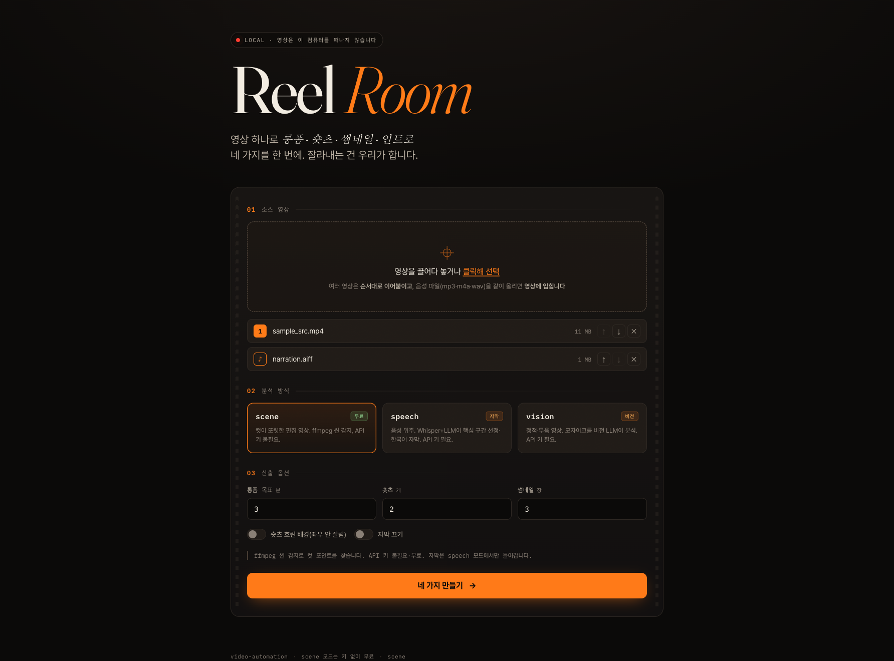

# video-automation

> **영상 1개 → 롱폼 · 숏츠 · 썸네일 · 인트로 4종.**
> 클라우드에 올리지 않고, 내 컴퓨터 안에서. `scene` 모드는 API 키 없이 무료.



## 30초 체험 — API 키 없이, 무료

```bash
git clone https://github.com/shdkej/video-automation
cd video-automation
python -m venv .venv && source .venv/bin/activate
pip install -r requirements.txt
# ffmpeg 필요 — macOS: brew install ffmpeg / Ubuntu: apt install ffmpeg / Windows: https://ffmpeg.org

python pipeline.py your_video.mp4 --mode scene   # 키 없이 4종 생성 → outputs/
```

음성 기반 자막·하이라이트(`speech`)나 비전 분석(`vision`)은 OpenAI/Anthropic 키가 필요하지만, **컷이 또렷한 영상이라면 `scene` 모드만으로 키 없이 바로** 써볼 수 있다.

## 왜 클라우드 도구(Opus Clip 등) 대신?

| | **video-automation** | 클라우드 SaaS |
|---|---|---|
| 영상 업로드 위치 | **내 컴퓨터 (안 떠남)** | 클라우드 서버 |
| 비용 | `scene` **무료** · AI 1시간 $0.01~0.5 | 월 구독 / 워터마크 |
| 산출물 | 롱폼+숏츠+썸네일+인트로 **4종 한 번에** | 보통 숏츠 위주 |
| 커스터마이즈 | **코드·프롬프트 직접 수정** | 불가 |
| 미공개 영상 | **프라이버시 보장** | 약관 의존 |

> 미발표 강의·제품 데모·개인 브이로그처럼 **공개 전 영상**을 다룬다면, "내 컴퓨터를 안 떠난다"는 클라우드 도구가 약관으로도 못 주는 가치다.
> (단, 숏츠/썸네일 선정은 LLM·scene 점수 기반 **후보 추출** 수준이다 — "바이럴 보장"이 아니라 "괜찮은 1차 컷"으로 보면 맞다.)

---

긴 영상을 자동으로 하이라이트 컷하는 미니멀 CLI. 영상 종류에 따라 3가지 모드 지원.

진입점은 셋:

- **`web/app.py`** — 브라우저 UI. 업로드 → 옵션 → 진행률 → 4종 미리보기·다운로드 (FastAPI)
- **`pipeline.py`** — 하나의 소스에서 **롱폼·숏츠·썸네일·인트로 4종**을 한 번에 추출 (분석 1회 재사용)
- **`auto_cut.py`** — 하이라이트 컷 1개만 (롱폼) 뽑는 저수준 CLI. pipeline이 내부적으로 사용

## 웹 UI

```bash
# 웹 전용 의존성 설치 (CLI만 쓰면 불필요)
pip install -r requirements-web.txt

# 서버 실행 후 http://127.0.0.1:8000 접속
python web/app.py
# 또는: uvicorn web.app:app --reload
```

영상을 (여러 개도 가능 — 순서대로 이어붙임) 업로드하고 모드(scene 무료 / speech 자막 / vision)·숏츠 개수·썸네일 장수를 고르면, 백그라운드 잡이 돌며 진행률이 표시되고 완료 시 4종을 브라우저에서 미리보고 다운로드한다. 잡 작업물은 `web/jobs/<id>/`에 남는다(gitignore). 단일 사용자 로컬 도구 가정 — 잡 상태는 인메모리.

**편집하고 다시 만들기**: 결과 화면의 편집기에서 자막 스타일(스타일별 데모 클립 미리보기)·효과(점프컷/펀치인)·음악(라이브러리 곡 미리듣기 후 선택, 또는 자동/끄기)·산출 수는 영상 전체 단위로, 글자(자막·훅 — 엔터 줄바꿈 그대로 반영)와 효과음(동봉 9종, 구간 시작에 재생)은 타임라인에서 구간별로 바꾼다. 구간을 탭하면 썸네일 위에 자막이 실제 비율로 겹쳐 보여 줄바꿈을 바로 확인할 수 있다. **분석(Whisper/LLM)은 캐시를 재사용**하고 build(ffmpeg)만 다시 돌므로 빠르다(`POST /api/jobs/{id}/rebuild`). 분석 자체(mode/길이)를 바꾸려면 새로 업로드한다.

**잡 자동 정리**: 새 잡을 만들 때마다 오래됐거나(기본 24시간) 개수를 초과한(기본 20개) 잡 폴더를 삭제한다(진행 중 잡은 보호). 기준은 환경변수로 조정한다 — `VIDAUTO_JOB_MAX_AGE_H`, `VIDAUTO_JOB_MAX_COUNT`.

**운영 가드**: 자원 폭주를 막는 안전장치도 환경변수로 조정한다.

| 환경변수 | 기본값 | 동작 |
|----------|--------|------|
| `VIDAUTO_MAX_CONCURRENT_JOBS` | `2` | 동시 처리 잡 상한. 초과하면 `429`로 거부(Whisper/ffmpeg는 CPU·메모리를 많이 씀). |
| `VIDAUTO_MAX_UPLOAD_MB` | `2048` | 잡당 업로드 총합 상한(MB). 초과하면 `413`으로 거부(스트리밍 중 차단, 디스크 보호). |
| `VIDAUTO_MAX_TRANSCRIPT_CHARS` | `120000` | speech 모드 LLM 프롬프트 길이 상한. 초과하면 분석을 중단(긴 트랜스크립트 → 입력 토큰·비용 폭주 방지). CLI/웹 공통. |

## 4종 산출 (pipeline.py)

```bash
# 한 줄로 4종 전체 생성 → outputs/
python pipeline.py input.mp4

# 여러 소스 → 순서대로 이어붙여 하나의 타임라인으로 처리
python pipeline.py clip1.mp4 clip2.mp4 clip3.mp4

# 음성 파일을 섞으면 영상에 입힐 사운드트랙으로 자동 인식 (무음 영상 + 별도 녹음)
python pipeline.py clipA.mp4 clipB.mp4 narration.m4a

# scene 모드(무료), 숏츠 3개, 세로 변환 시 흐린 배경
python pipeline.py input.mp4 --mode scene --shorts-count 3 --shorts-blur

# 일부만 — 숏츠와 썸네일만
python pipeline.py input.mp4 --only shorts thumbnail
```

> **여러 소스**를 주면 각 소스를 첫 소스 해상도에 맞춰 정규화(scale+pad·fps 통일·오디오 보장)한 뒤
> 이어붙여 단일 타임라인으로 분석한다. 해상도·코덱·오디오 유무가 달라도 안전하다.
> 합친 영상은 `outputs/_merged_source.mp4`로 남는다.
>
> 입력에 **오디오 파일**(`.mp3`/`.m4a`/`.wav` 등)이 섞여 있으면 이어붙이지 않고 **영상에 입힐
> 사운드트랙으로 자동 인식**해 mux한다(`outputs/_muxed_av.mp4`). `--audio`를 명시하면 그쪽이 우선.
> `.webm`/`.mkv`처럼 오디오만 담길 수도 있는 컨테이너는 확장자가 아니라 **실제 비디오 스트림 유무**로
> 가른다(음성만 든 `.webm`도 사운드트랙으로 인식). 웹에서도 같은 규칙(음성은 리스트에 ♪로 표시).

| 산출물 | 형태 | 비고 |
|--------|------|------|
| `longform.mp4` | 하이라이트 컷 16:9 | 클립별 자막 burn-in (**speech 모드만** — 아래 참고) |
| `shorts_NN.mp4` | 세로 9:16 | 임팩트 상위 N개, **침묵 제거 점프컷 + punch-in 교차**, 카라오케 자막, 첫 프레임 풀노출(페이드인 없음) |
| `shorts_NN_cover.jpg` | 세로 커버 | 숏츠별 첫 장면(hook 배너 포함) — 릴스 커버용 |
| `thumbnail_NN.jpg` | 후보 N장 | 구간을 시간축으로 분산해 N장(기본 3, 1장이면 `thumbnail.jpg`), 컬러 그레이드 + **hook 문구 burn-in** |
| `intro.mp4` | hook 클립 3~5초 | 베스트 구간 앞부분 + fade (풀스크린 타이틀 카드 안 씀) |

> **자막은 speech 모드에서만 들어간다.** scene/vision은 발화 텍스트가 없어 자막을 비운다
> (디버그용 `scene_score=…` 같은 문자열이 영상에 박히지 않도록). 자막이 필요하면 speech 모드를 쓴다.

### 자막 엔진

자막은 두 엔진 중 하나로 그린다 — `--sub-engine`(기본 `remotion`).

| 엔진 | 방식 | 특징 |
|------|------|------|
| `remotion` (기본) | Remotion으로 **투명 애니메이션 자막**을 알파 webm으로 렌더 → ffmpeg overlay 1회 합성 | 페이드/단어 등장, 숏츠 hook 배너. `remotion-map` node 의존성 필요 |
| `pil` | PIL 정적 PNG를 구간별 burn-in | 가볍고 추가 의존성 없음 |

- `--sub-style`(remotion 전용): `fade`(전체 페이드, 기본) / `kinetic`(단어별 순차 등장).
- **숏츠**는 자동으로 펀치 자막 + 상단 hook 배너로 그려진다(`mode=shorts`). 트랜스크립트에 단어 타임스탬프(`words`)가 있으면 **실제 발화 타이밍 카라오케**로, 구캐시(words 없음)는 균일 등장으로 폴백한다.
- Remotion 엔진의 렌더 **동시성은 머신 CPU 코어 수에 맞춰 자동 조정**되고, 지도 데이터 준비(`prepare`) 없이도 자막만 단독으로 렌더된다 — 코어가 적은 머신·맵 미사용 환경에서도 바로 동작.

**부분 실패 격리**: 4종 중 하나가 실패해도 나머지는 생성되고, 끝에 실패한 종만 `--cache --only <종>`으로 재시도하라는 안내가 나온다. `--cache`는 `outputs/selection.json`을 재사용해 **LLM/Whisper 재호출 비용을 아낀다**.

주요 옵션: `--only`, `--shorts-count`(기본 2), `--shorts-ideal-seconds`(기본 25), `--shorts-max-seconds`(기본 45), `--shorts-blur`, `--shorts-silence-min`(기본 0.45 — 점프컷으로 제거할 최소 무음), `--no-shorts-jumpcut`·`--no-shorts-punchin`(트렌드 편집 끄기, A/B 비교용), `--montage-seconds`(기본 자동 — 아래 참고), `--thumbnail-count`(기본 3), `--no-thumb-text`, `--intro-seconds`(기본 4), `--cache`, `--no-subtitle`, `--no-grade`, `--sub-engine`(기본 `remotion`), `--sub-style`(기본 `fade`). 분석 옵션(`--mode`/`-t`/`--llm-model` 등)은 auto_cut과 동일.

> 숏츠는 speech 모드에서 단어 타임스탬프 기반으로 **0.45초+ 무음을 잘라내는 점프컷**과 컷 경계 **1.0x↔1.08x punch-in**을 기본 적용한다(생성 로그에 무음 제거량·점프컷 수·초당 화면변화 측정치 출력). scene/vision·구캐시는 자동으로 통짜 클립 + 주기적 punch로 폴백한다.

> **몽타주 트림(짧은 클립 모음)**: 총 길이가 롱폼 목표 이하면 전체를 몽타주 숏폼 1개로 만든다. 이때 클립별 트림은 기본이 **숏츠 예산 역산** — 총량이 `--shorts-ideal-seconds`(25초) 이하면 전체 유지, 초과하면 예산을 클립 수로 나눠 트림한다. 어느 구간을 남길지는 장면 자막 비전 LLM이 클립당 초·중·후반 3프레임을 보고 고른 **핵심 순간(peak)** 중심이고, 통으로 이어져야 하는 클립은 **keep=whole**로 트림에서 제외된다(LLM 키 없으면 모션 폴백, speech면 단어 경계 스냅). `--montage-seconds N`은 클립당 N초 고정(구버전 모션 동작, A/B용), `0`은 무트림.

## 모드

| 모드 | 적합한 영상 | 신호원 | 비용 |
|------|------------|--------|------|
| `speech` (기본) | 음성 위주 (강연, 인터뷰, 브이로그) | Whisper 트랜스크립트 + LLM | $0.01~$0.5 / 1시간 |
| `scene` | 컷이 명확한 편집 영상 (트레일러, 광고) | ffmpeg scene 감지 | 무료 |
| `vision` | 정적/무음 영상 (풍경, 일상, b-roll) | 모자이크 그리드 + 비전 LLM | $0.01~$0.05 / 1시간 |

## 파이프라인

```
[speech]  영상 → Whisper(트랜스크립트) → LLM(구간 선정) → ffmpeg(컷+concat)
[scene]   영상 → ffmpeg scene 감지(점수)  → 상위 N개 선택  → ffmpeg(컷+concat)
[vision]  영상 → ffmpeg tile(모자이크)    → 비전 LLM(JSON) → ffmpeg(컷+concat)
```

## 설치

```bash
python -m venv .venv
source .venv/bin/activate
pip install -r requirements.txt

# ffmpeg 필요
brew install ffmpeg

# 애니메이션 자막(기본 엔진)을 쓰려면 remotion-map에서 한 번만 설치
# (PIL 정적 자막 --sub-engine pil 만 쓰면 생략 가능)
cd remotion-map && npm install && cd ..
```

## 사용

API 키는 `.env` 파일에 두거나(`cp .env.example .env`) 환경 변수로 export.

```bash
# speech 모드 (기본) — 음성 트랜스크립트 기반
python auto_cut.py input.mp4 -t 10

# 영상에 오디오가 없고 별도 파일로 있는 경우 (자동 mux)
python auto_cut.py video_only.mp4 --audio audio_only.m4a -t 5

# scene 모드 — 컷이 명확한 영상 (API 키 불필요)
python auto_cut.py input.mp4 --mode scene -t 5 --scene-threshold 0.3

# vision 모드 — 정적 영상도 OK, 모자이크 1장만 LLM에 전송
python auto_cut.py input.mp4 --mode vision -t 5 --llm-model gpt-4o-mini

# 모델 명시 — 이름 prefix로 provider 자동 분기
python auto_cut.py input.mp4 --llm-model claude-opus-4-7
python auto_cut.py input.mp4 --llm-model gpt-4o

# dry-run으로 선정 결과만 확인 (모자이크/트랜스크립트는 저장됨)
python auto_cut.py input.mp4 --mode vision --dry-run
python auto_cut.py input.mp4 --cache --dry-run
```

## 옵션

| 옵션 | 기본값 | 설명 |
|------|--------|------|
| `--mode` | `speech` | `speech` / `scene` / `vision` |
| `--audio` | none | 별도 오디오 파일. 영상과 자동 mux 후 `<input>_av.mp4`를 입력으로 사용 |
| `-t, --target-minutes` | `10.0` | 목표 길이(분) |
| `-m, --whisper-model` | `medium` | speech 모드: `tiny`/`base`/`small`/`medium`/`large-v3` |
| `--language` | `ko` | speech 모드: 언어 코드 (`auto` 가능) |
| `--llm-model` | 자동 | `claude-*` → Anthropic, `gpt-*`/`o3-*` → OpenAI |
| `--scene-threshold` | `0.3` | scene 모드: ffmpeg scene 점수 임계값 (0~1) |
| `--clip-seconds` | `6.0` | scene/vision 모드: 각 클립 길이(초) |
| `--cache` | off | speech 모드: 트랜스크립트 재사용 |
| `--dry-run` | off | 컷 생략, 선정 결과만 저장 |

기본 LLM 자동 선택: `ANTHROPIC_API_KEY` → `claude-sonnet-4-6` / `OPENAI_API_KEY` → `gpt-4o-mini`.

## 모드별 동작 요약

**speech**: Whisper로 음성 → 한국어 인식 품질 검증(임계: 0.3자/초) → LLM에 트랜스크립트 + 목표 길이 전달 → LLM이 반환한 구간 중 트랜스크립트 segment와 겹치는 것만 채택 (환각 차단).

**scene**: ffmpeg `select='gt(scene,T)',metadata=print` 로 컷 포인트와 점수 추출 → 점수 상위부터 `clip-seconds` 길이 클립으로 만들어 목표 길이까지 채움 → 겹치는 클립은 스킵.

**vision**: ffmpeg `tile=NxM` 으로 영상을 균등 샘플링한 모자이크 1장 생성(예: 17.5분 → 7×8=56컷, 18.8초 간격) → 비전 LLM에 모자이크 + 시점 매핑 프롬프트 전송 → JSON으로 받은 시점들을 클립으로 변환.

## 비용 / 속도 감각

- Whisper `medium` (기본): 1시간 영상 M-시리즈 Mac 기준 15~25분 (로컬, 무료). 빠르게 보려면 `-m small` (5~10분)
- speech 모드 LLM (1시간, ~10k 입력 토큰):
  - `gpt-4o-mini` ≈ $0.005 / `gpt-4o` ≈ $0.08 / `claude-sonnet-4-6` ≈ $0.10 / `claude-opus-4-7` ≈ $0.50
- vision 모드 LLM: 모자이크 1장(~2240×1440, 약 1500~3000 입력 토큰) + JSON 응답
  - `gpt-4o-mini` ≈ $0.001 / `claude-sonnet-4-6` ≈ $0.01
- scene 모드: ffmpeg만 사용, 비용 0. 영상 길이의 1/3 정도 소요

## 알려진 한계

- speech: 트랜스크립트 정확도가 결과 품질 좌우. 잡음 영상은 `medium` 이상 권장. 컷 경계가 단어 중간에 걸릴 수 있음.
- scene: 카메라 고정/부드러운 영상은 scene 점수가 0.03 이하라 컷 포인트가 안 잡힘 → vision 모드 사용.
- vision: 모자이크 셀 해상도(320×180)에서 식별 가능한 수준의 차이만 잡힘. 미세한 움직임은 약함.

## 다음 개선 후보

- 화자 분리(pyannote)로 발화자 단위 컷
- 모드 자동 폴백 (speech 실패 시 vision)
- 숏츠 hook 시점 (현재는 LLM/scene 임팩트 점수로 구간 선정 + 중앙 절단 → 구간 내 정확한 hook 프레임까지 LLM 질의)
- 썸네일 후보 랭킹 (현재는 시간 분산 → 얼굴/대비/장면전환 신호로 CTR 높은 프레임 우선)
- BGM 자동 삽입(effects.add_bgm) pipeline 연동
